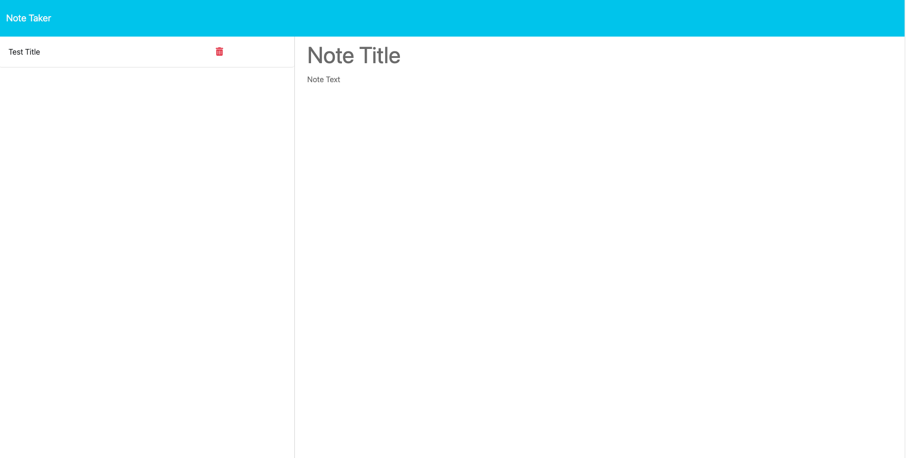
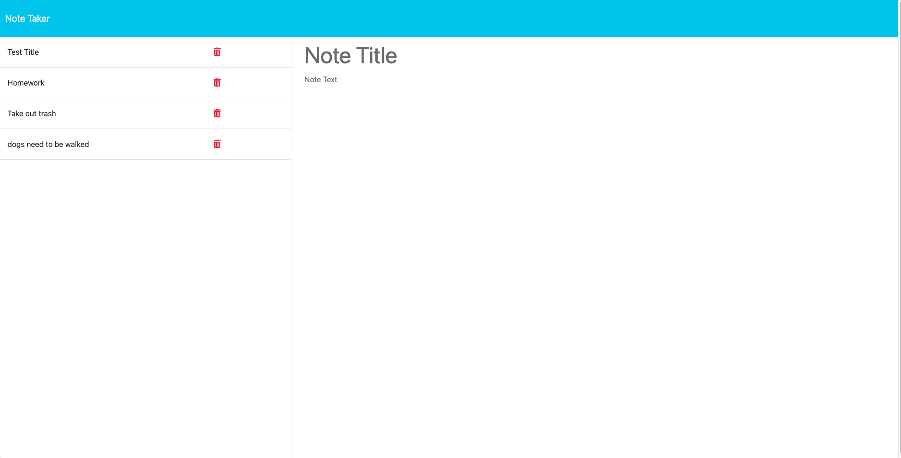
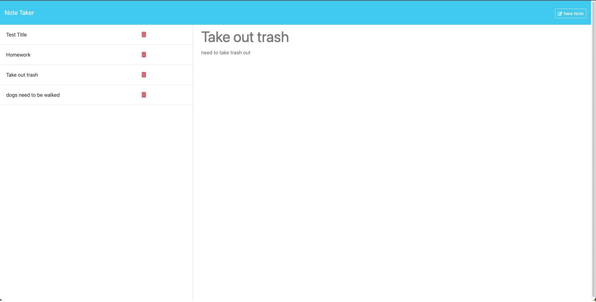
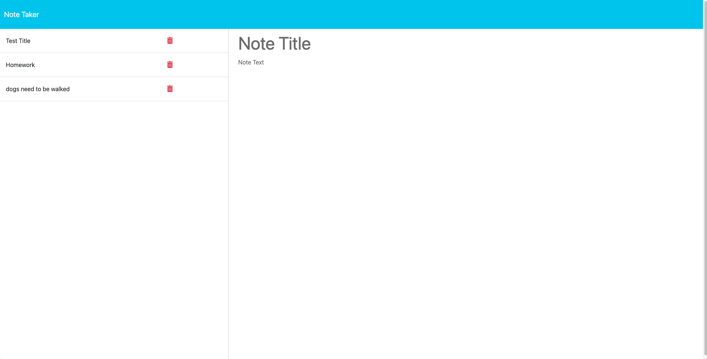

# note-taker

## Description

- My motivation for this project was to be able to use express.js to create GET and POST routes successfuly and to communicate
  my backend server with the front end.
- I built this project to have an application that can save, read and delete notes inputed by the user.
- This application solves the problem of having a place to keep track of all your notes and things to do.
- I learned how to use Express.js to communicate with the front end of the application and how to successfully create routes in my JavaScript files.

## Table of Contents

- [Installation](#installation)
- [Usage](#usage)
- [Credits](#credits)
- [License](#license)

## Installation

To install this application, simply click on this link and the application will be accessible in your browser.
https://note-taker-dh-3df82608d85b.herokuapp.com/

## Usage

To use this application, enter a title and text for your note. Click the save icon in the top right hand side of the screen. Your note will be added
to the left sidebar of the application. If you click the trash icon, your note will be deleted.
The following screeenshots show how to use this application.

## Credits

My tutor, Mila Hose, helped me with fixing my POST route file path to be able to properly display the notes on the screen.

## License

## N/A
